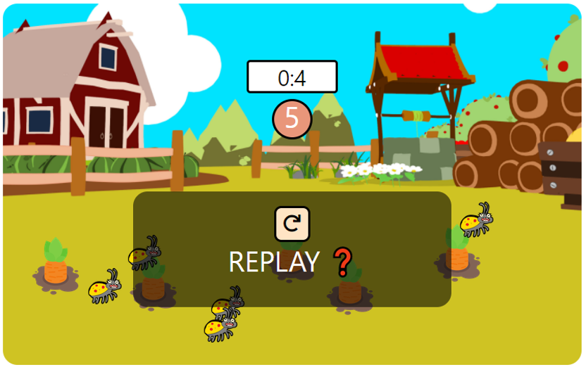

# 🐞 벌레를 피해 🥕 당근을 뽑아라!

## 📄 프로젝트 소개

HTML, CSS, JavaScript를 활용해 만든 간단한 미니 게임으로 제한시간 내에 랜덤 배치된 `🐞 벌레`를 피해 `🥕 당근`을 클릭하면 게임 클리어가 되는 방식입니다. 

총 6가지의 `게임 스타트 BGM, 당근 클릭 BGM, 벌레 클릭 BGM, 승리 BGM, 패배 BGM, 리플레이 BGM`도 있습니다.

## 사용한 기술 ❗

### 💬Language

- HTML
- CSS
- Java Script

## 주요 기능 ❗

1️⃣ 랜덤으로 배치된 `🥕 당근`을 클릭 시 남은 당근의 수가 카운트 되며 이미지를 감추고 당근을 모두 제거시 성공 BGM과 `YOU WIN 😆` 메세지를 화면에 출력  
2️⃣ 랜덤으로 배치된 `🐞 벌레`를 클릭 시 타이머와 남은 카운트가 멈추고 실패 BGM과 `YOU LOSE 😥` 메세지를 화면에 출력  
3️⃣ 멈춤 버튼을 클릭 시 타이머와 남은 카운트가 멈추고 `REPLAY ❓` 메세지를 화면에 출력  
4️⃣ REPLAY 버튼을 클릭 시 화면이 초기화 되면서 `🐞 벌레`와 `🥕 당근`을 랜덤 재배치 후 게임 재시작  
5️⃣ 각 상황별 BGM 출력

## 💻 게임 화면

|                                 게임 설명                                 |               게임 시연 영상               |
| :-----------------------------------------------------------------------: | :----------------------------------------: |
|        |     |
|     |  |
|  |       |
|       |       |
|       |                     ❌                     |
